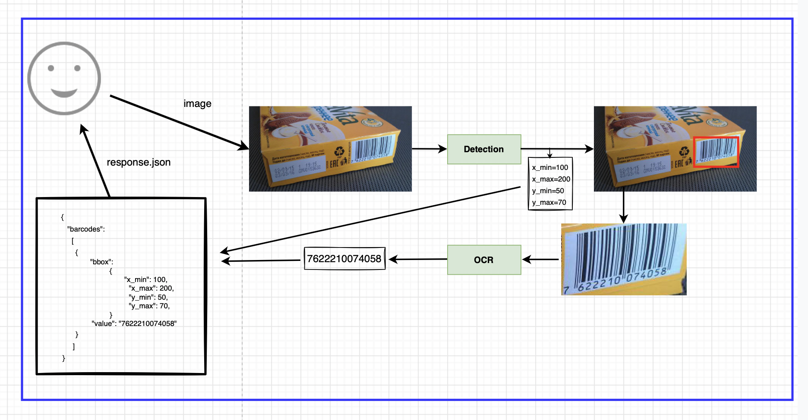

# Задание 2:
Строим сервис по распознаванию штрих-кодов. 

Хотим по фоткам находить положения всех штрих-кодов и значения этих штрих-кодов.

Для этого построим такую систему:

Как видно, в сервисе есть две модели: детекция (сегментация) и OCR.

Датасет соберем на Толоке. 

Задание состоит из нескольких частей. Каждую (кроме сервиса) можно делать и сдавать независимо от других.

#### 1. Толока. [Описание](toloka.md)

#### 2. Сегментация/детекция. [Описание](segmdet.md)

#### 3. OCR. [Описание](ocr.md)

#### 4. Сервис. [Описание](service.md)

Если пропустили часть про толоку, то можно воспользоваться парой собранных датасетов
от добрых студентов с прошлого потока [тык](https://disk.yandex.ru/d/nk-h0vv20EZvzg). Или
просто дополнить ими собранный датасет:)

Не забываем записаться в [табличку](https://docs.google.com/spreadsheets/d/1mQSsBWeq29IGiwqAXKfsON8lx-2yQVTdM5r7EnPV8eg/edit#gid=574321097),
чтобы вашу работу точно не потеряли.
