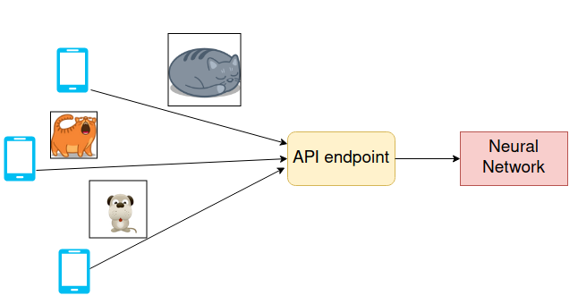
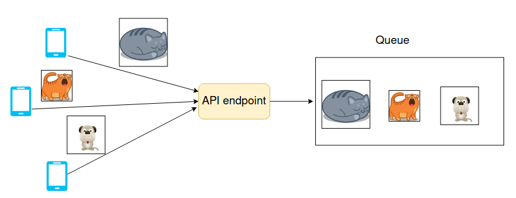
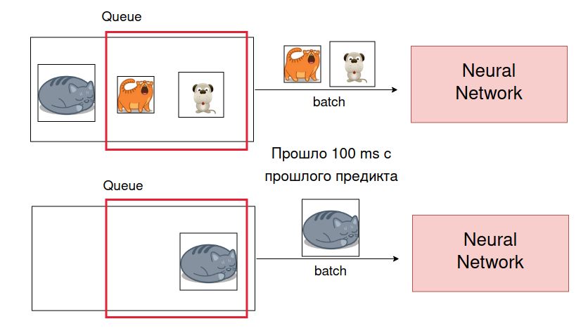
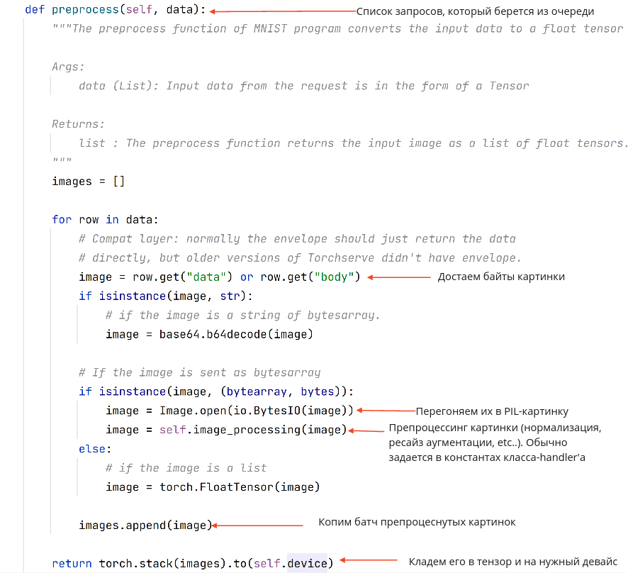
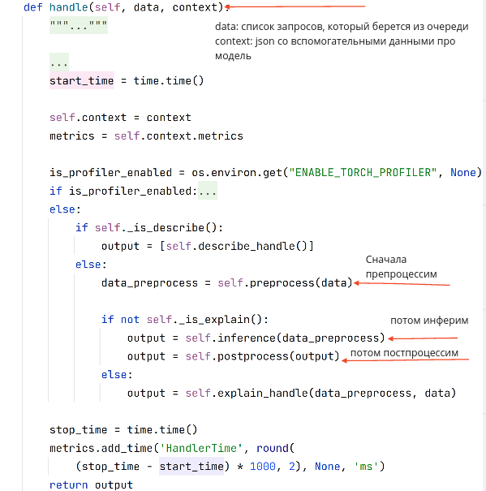
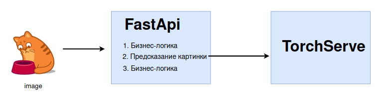
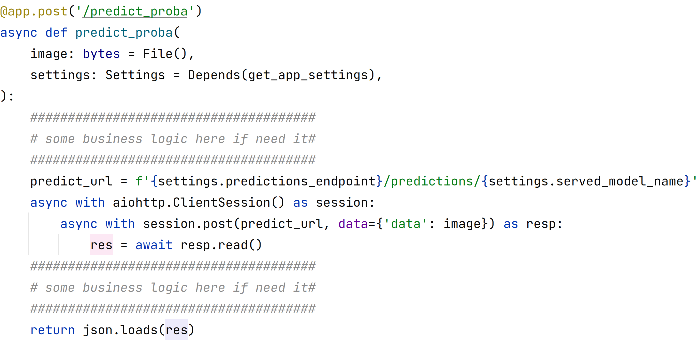

# Torchserve

Можно заметить, что в нашем сервисе мы сейчас предсказвыаем
по одной картинке. Если на сервис будет большая нагрузка,
то такая стратегия будет неэффективной.

Эффективнее будет
предсказывать картинки батчами. Но клиенты шлют нам запросы по одному.


Как сделать из этого
батч? Добавить асинхронности!

Когда к нам придёт картинка, мы не потащим её сразу в нейросеть, а сложим в промежуточную
очередь.

Раз в какое-то время мы будем выгребать батчи картинок из этой очереди. В примере на рисунке
мы раз в 100ms выгребаем батч размера 2. Если полный батч не набирается, то отправляем сколько
набралось.


Подход с промежуточной очередью очень популярен в высоконагруженных системах. Он помогает
бороться со всплесками нагрузки и увеличивает пропускную
способность. [Latency vs Throuhgput](https://www.comparitech.com/net-admin/latency-vs-throughput/).

Подход с промежуточной очередью не так сложно сделать самому, но мы сегодня рассмотрим
torchserve, в котором всё реализовано из коробки.

### Подготовим окружение
```bash
python3 -m venv venv
. venv/bin/activate
pip install -r requirements.txt
```

### Скачаем веса

Сегодня будем инферить модельку для классификации постеров. В самом начале скачаем ее
веса: `make download_weights`. Они окажутся по пути `weights/genre_classifier.pt`

### Подготовка torchserve

[Инструкция torchserve](https://github.com/pytorch/serve/blob/master/docker/README.md), из которой мы скопируем все
нужные файлики.

#### Собрать образ:

Под CPU и GPU нужно собирать свои образы torchserve. Выберите подходящий для вас

GPU:

```bash
#  Supported values cu92, cu101, cu102, cu111, cu113, cu116
make build_ts_cuda CUDA_VERSION=<your-cuda-version>
```

CPU:

```bash
make build_ts_cpu
```

Запустить образ torchserve:

GPU:

```bash
make run_ts_cuda CUDA_VERSION=<your-cuda-version>
```

CPU:

```bash
make run_ts_cpu
```

### Загрузка моделей в TorchServe

Чтобы проинферить модельку в TorchServe обычно достаточно следующих сущностей:

* Имя модельки - уникальный идентификатор. По нему будем в будущем обращаться к модельке
* Ее версия
* Чекпоинт модельки. Тот самый `model.pt`, полученный например при помощи torchscript
* Handler. Классец, который будет инферить этот самый чекпоинт
* `requirements.txt`. Дополнительные зависимости, которые нужно установить, чтобы проинферить модельки (необязательно)
* `extra_files`. Дополнительные файлы, которые нужны Handler'у, чтобы проинфериться. Например, другие питонячьи модули (
  необязательно)
* Полный список сущностей можно
  посмотреть [здесь](https://github.com/pytorch/serve/blob/master/model-archiver/README.md)

#### Генерируем .mar

Далее, у торча есть специальная
тула [model-archiver](https://github.com/pytorch/serve/blob/master/model-archiver/README.md) для того, чтобы всё это
упаковать.
Ее можно дёргать как из консоли, так и из питона. Сегодня остановимся на втором варианте.

Код для генерации лежит в `ts_serialize`. Он просто при помощи библиотеки от торча упаковывает все аргументы, которые
были перечислены выше.

Запустим его:

```bash
make generate_mar
```

В папке `model_mars` должен был появиться файлик `my_model.mar`. `.mar` - это расширение, в котором torchserve 'кушает'
наши модельки.
Это просто zip-архив (можно прям нажать
unzip my_model.mar и посмотреть, что там внутри), в котором как раз и лежат наш чекпоинт, handler, requirements и т.д.
Так же внутри можно найти файлик `MANIFEST.json`, в котором лежит вот что:

```json
{
  "createdOn": "25/09/2022 14:55:42",
  "runtime": "python",
  "model": {
    "modelName": "my_model",
    "serializedFile": "genre_classifier.pt",
    "handler": "model_handler.py",
    "modelVersion": "1.0",
    "requirementsFile": "requirements.txt"
  },
  "archiverVersion": "0.6.0"
}
```

В нашем примере в `requirements.txt` лежат на самом деле две необязательные библиотеки
(они и так есть внутри образа torchserve). Просто чтоб был пример, как подтягивать зависимости.

#### Про handler

`Handler` - это класс, который будет инферить наш чекпоинт на прилетающих картинках.

У него обычно должны быть реализованы следующие методы:

* `initialize`: в этом методе обычно подгружается чекпоинт модельки и какие-то вспомогательные файлы
* `preprocess`: на вход обычно подается список "сырых" запросов с картинками. Возвращает тензор батча из пришедших
  картинок. Пример, как этот метод реализован
  в [VisionHandler](https://github.com/pytorch/serve/blob/master/ts/torch_handler/vision_handler.py):
  
* `inference`: прогон батча из preprocess-шага через модельку
* `postprocess`: постпроцессинг того, что выплюнул `inference`. Обычно содержит список респонсов
* `handle`: главный метод, который оркестрирует методы выше (кроме initialize).
  Пример, как этот метод реализован
  в [BaseHandler](https://github.com/pytorch/serve/blob/master/ts/torch_handler/base_handler.py):
  

Посмотреть как hander реализован у нас можно в [ts_serialize/model_handler.py](ts_serialize/model_handler.py).

Мы наследовались от VisionHandler, поэтому нам почти ничего не нужно реализовывать.

Мы добавили

* `image_processing`: специфичный для нашей задачи препроцессинг картинки
* Переопределили `initialize`: добавили к стандартному запоминание списка классов, которые мы предсказываем
* Переопределили `postprocess`: из батча вероятностей возвращаем список словарей типа `{'имя класса': 'вероятность'}`
  Т.е. сейчас клиенты torchserve в ответ на каждую картинку будут получать json вида `{'имя класса': 'вероятность'}`

Буквально 30 строчек и handler готов. Красота!

### Как положить модельку в torchserve

Мы упаковали модельку в `.mar` файлик и запустили torchserve. Но torchserve
пока ничего не знает о нашей модельке. Нужен способ ее доставить. Мы будем это делать
при помощи [Management API](https://pytorch.org/serve/management_api.html).

Management API - это API torchserve, которое позволяет управлять (ваш кэп) модельками, а именно:

* Загружать модели
* Удалять
* Смотреть какие модели есть
* Увеличивать количество воркеров на модель
* Менять параметры инференса модели

Рекомендую прочесть [доку](https://pytorch.org/serve/management_api.html).

Пример загрузки модели из доки:

```bash
curl -X POST  "http://localhost:8081/models?url=https://torchserve.pytorch.org/mar_files/squeezenet1_1.mar"

{
  "status": "Model \"squeezenet_v1.1\" Version: 1.0 registered with 0 initial workers. Use scale workers API to add workers for the model."
}
```

Как видим, management API принимает ссылку до `.mar`-файла. А наш файлик лежит просто на диске.
Обычно в компании есть blob-хранилище, на которое и нужно отправить ссылку на модельку. И эту
ссылку уже кормить в management API. Но мы сейчас не будем разворачивать никакие хранилища и всё
сделаем локально.

#### Как получить ссылку на файлик

Будем делать это при помощи [nginx-file-browser](https://github.com/mohamnag/nginx-file-browser).

На сегодня можно считать, что эта тула просто сервит какую-то папку (позволяет загружать из нее файлы по ссылке).

Запустить:

```bash
make run_nginx_filebrowser
```

Поднимется контейнер с этой тулой. Проверить, что все ок можно сходив на http://0.0.0.0:5002 .
Если видите там `my_model.mar`, то все отлично.

Теперь можно "скачать" модельку:

```bash
wget http://0.0.0.0:5002/files/my_model.mar
```

Теперь нужно получить IP вашего компьютера в локальной сети.

прожимаем

```bash
ifconfig
```

находим там ip, который похож на что-то такое `192.168.0.105` (обычно около enp6s0) и вставляем этот IP
в мейкфайл в `MACHINE_IP`

Нам это нужно для того, чтобы из контейнера torchserve мы могли ходить по урлам на наш компьютер.

#### Собственно, загружаем модельку

Все взаимодействие с этим API у нас написано в модуле [upload_model](upload_model.py).

Что в нем происходит:
при подгрузке новой модельки мы спрашиваем все предыдущие версии этой модельки, удаляем их и загружаем
в torchserve эту новую версию модельки.

Посмотрим на параметры, которые используются этим модулем:
(особенно внимательно на место, где возможно придется изменить IP)

```yaml
served_model:
  model_name: "my_model"  # то самое имя модели, по которому будем к ней обращаться
  request_params:
    url: 'http://192.168.0.105:5002/files/my_model.mar'  # ссылка на модель. Здесь возможно придется подменить IP на ваш
    model_name: ${served_model.model_name}
    batch_size: 2  # размер батча, с которым torchserve будет инферить модельку
    initial_workers: 1  #  сколько экземпляров модельки поднято
    max_batch_delay: 50  #  время, в течение которого копится батч
```

Запустим этот скрипт:

```bash
make upload_model
```

В логах должно быть что-то типа такого:

```
 INFO upload_model.py:45 _upload_model Model my_model was uploaded. Response {
  "status": "Model \"my_model\" Version: 1.0 registered with 1 initial workers"
}
```

Ура, мы загрузили модельку!

#### А теперь предскажем:

для предсказания у torchserve используется [Inference API](https://pytorch.org/serve/inference_api.html)

Предскажем картинку:

```bash
curl http://0.0.0.0:8080/predictions/my_model -F 'data=@imgs/img1.jpg'
```

Должен был вернуться json с маппингом class_name:prob. Ровно то, что мы возвращаем в `postprocess` 
у handler'а.

### Предсказываем из FastApi:

Кидать картинки от клиента напрямую в torchserve можно, но иногда не удобно. Обычно возникает такой путь:

1) Картинка пришла
2) Слой бизнес-логики
3) Предсказываем картинку
4) Слой бизнес-логики
5) Отдаем 

Так же может быть небезопасно слать картинки с клиента сразу в torchserve. 

Давайте построим такой процесс: 



Т.е. картинка будет сначала идти в приложение FastApi, а в TorchServe будем идти уже для
непосредственно предсказания картинки.

Код для этого дела можно посмотреть в [app.py](app.py)



Т.е. когда к нам приходит картинка, мы в нужный момент просто проксируем ее в TS. TS уже сам будет
копить очередь и предсказывать батчем, нам со стороны клиента это даже не видно. 

Заметим, что мы здесь используем асинхронный HTTP-клиент, чтобы поход в TS не был для FastApi блокирующим.

Запустим наше приложение:

```bash
make run_app
```

Приложение по дефолту будет крутиться на порте 5003. Можно открыть старый-добрый swagger и
кинуть туда картинку: http://0.0.0.0:5003/docs


### Пуляем много картинок
Слать по одной картинке через swagger не интересно. Мы до этого говорили, что батчинг будет ощутим только при нагрузке.

В модуле [stress.py](stress.py) моделируется ситуация, когда в наше приложение много клиентов одновременно 
шлют свои картинки. В нем так же логгируется, сколько картинок в секунду мы успеваем обрабатывать.

Жмем 

```bash
make run_stress
```

Вывод консоли должен быть какой-то такой:

```
INFO stress.py:37 run_stress Perfomance: 60.52 imgs/s
INFO stress.py:37 run_stress Perfomance: 57.33 imgs/s
INFO stress.py:37 run_stress Perfomance: 62.68 imgs/s
INFO stress.py:37 run_stress Perfomance: 59.72 imgs/s
INFO stress.py:37 run_stress Perfomance: 63.32 imgs/s
INFO stress.py:37 run_stress Perfomance: 64.79 imgs/s
INFO stress.py:37 run_stress Perfomance: 60.87 imgs/s
INFO stress.py:37 run_stress Perfomance: 63.07 imgs/s
INFO stress.py:37 run_stress Perfomance: 64.99 imgs/s
INFO stress.py:37 run_stress Perfomance: 59.99 imgs/s
INFO stress.py:38 run_stress Mean perfomance: 61.73 img/s with std: 2.32
```

### Экспериментируем

Сейчас в [конфиге](config/config.yaml) выставлены дефолтные параметры для `batch_size` и `max_batch_delay`.
С ними можно поиграться, чтобы из одной и той же машины можно было выжимать больше картинок в секунду. 

1) Для этого поменяйте параметры в конфиге
2) Перезалейте модель: `make upload_model`
3) Запустите стресс-тест `make run_stress` и посмотрите на полученный perfomance